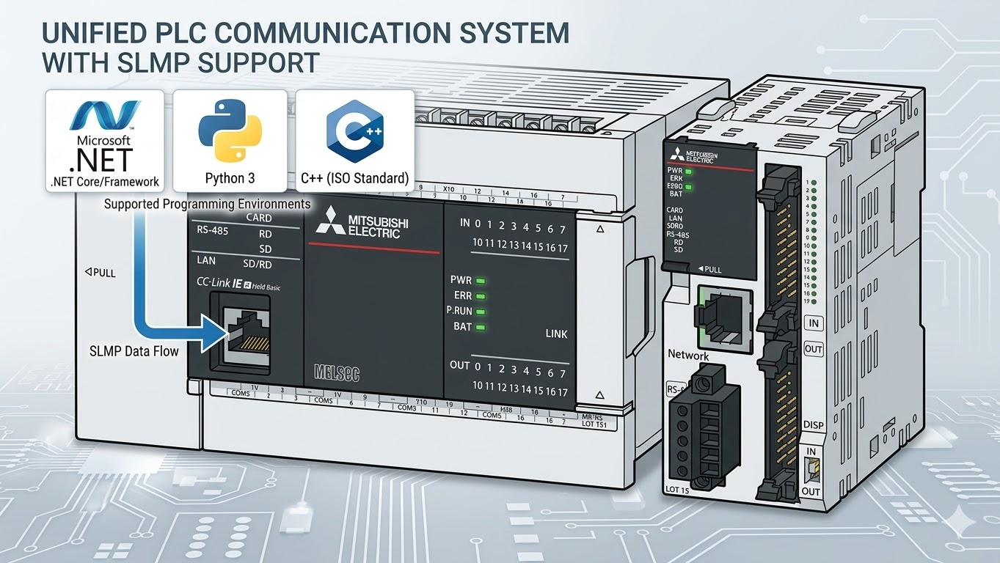

[](https://github.com/fa-yoshinobu/plc-comm-slmp-python/actions/workflows/ci.yml)
[](https://fa-yoshinobu.github.io/plc-comm-slmp-python/)
[](https://www.python.org/downloads/)
[](LICENSE)
[](https://github.com/astral-sh/ruff)

# SLMP Protocol for Python



A high-performance, strictly typed Python client library for Mitsubishi SLMP (Seamless Message Protocol). Supporting Binary 3E and 4E frames for iQ-R, iQ-F, and Q series PLCs.

## Key Features

- **Strict Protocol Compliance**: Based on official Mitsubishi Electric English specifications.
- **Binary Support**: Efficient Binary 3E/4E frame communication.
- **Modern Python**: Fully type-hinted (Mypy-ready) and asynchronous-friendly.
- **CI-Ready**: Built-in quality checks and single-file CLI tool distribution.

## Quick Start

### Installation
```bash
pip install slmp-connect-python
```

### Quick Command (Copy/Paste)

```bash
python scripts/slmp_connection_check.py --host 192.168.250.100 --series auto --frame-type auto
```

Optional UDP check (port 1027):

```bash
python scripts/slmp_connection_check.py --host 192.168.250.100 --port 1027 --transport udp --series auto --frame-type auto
```

### Basic Usage
```python
from slmp.client import SlmpClient

# Connect to a MELSEC iQ-R PLC
client = SlmpClient("192.168.250.100", 1025)

# Read D100 - D104 (5 words)
values = client.read_devices("D100", 5)
print(f"Values: {values}")

# Write to M0
client.write_devices("M0", [True], bit_unit=True)
```

## Device Support (PLC Device Codes)

This list reflects device codes accepted by the parser and typed APIs. Actual availability depends on PLC model, firmware, and access settings.

| Group | Codes | Status | Notes |
| --- | --- | --- | --- |
| Bit devices (direct) | SM, X, Y, M, L, F, V, B, TS, TC, STS, STC, CS, CC, SB, DX, DY | Supported | `X/Y/B/SB/DX/DY` use hexadecimal numbering. |
| Word devices (direct) | SD, D, W, SW, TN, STN, CN, Z, LZ, R, ZR, RD | Supported | `W/SW` use hexadecimal numbering. |
| Long timer / counter families | LTS, LTC, LTN, LSTS, LSTC, LSTN, LCS, LCC, LCN | Supported (direct) | Some PLCs reject direct access; prefer long-timer helpers when available. |
| Extended Specification qualified devices | `Uxx\\Gyy`, `Uxx\\HGyy` | Supported via Extended Specification APIs | Direct `G/HG` access is not supported. |
| Link direct devices | `Jx\\device` (e.g. `J2\\SW10`, `J1\\X10`) | Supported via Extended Specification APIs | CC-Link IE network device access. Use `read_devices_ext` / `write_devices_ext`. |

## Verified Hardware

The following hardware models have been physically tested and verified for compatibility:

- **MELSEC iQ-R Series**: R120PCPU, R08PCPU, R08CPU, R00CPU, RJ71EN71
- **MELSEC iQ-L Series**: L16HCPU
- **MELSEC iQ-F Series**: FX5U-32MR/DS, FX5UC-32MT/D
- **MELSEC-Q Series**: 
  - Q06UDVCPU (Serial No. prefix: 17062)
  - Q26UDEHCPU (Serial No. prefix: 20081)
  - QJ71E71-100 (Serial No. prefix: 24071)
- **MELSEC-L Series**: L26CPU-BT (Serial No. prefix: 11112)
- **Keyence KV Series** (MC Protocol): KV-7500, KV-XLE02

## Use Cases

- Quick diagnostics scripts for field engineers (SM/D reads, profile auto-detect).
- Data collection pipelines (periodic reads, export to CSV/DB).
- Compatibility probing and reporting across mixed PLC fleets.

## Documentation

The project follows a modern hierarchical documentation policy:

- [**User Guide**](docsrc/user/USER_GUIDE.md): Installation, connection setup, and API examples.
- [**Device Reference**](docsrc/user/BIT_DEVICE_ACCESS_TABLE.md): Bit/Word device access tables.
- [**QA Reports**](docsrc/validation/reports/): Formal evidence of communication with real PLC hardware.
- [**PLC Compatibility Matrix**](docsrc/validation/reports/PLC_COMPATIBILITY.md): Verified SLMP command support across Mitsubishi PLC families.
- [**Developer Docs**](docsrc/maintainer/PROTOCOL_SPEC.md): Internal architecture and protocol details.

## Development & CI

This project enforces strict quality standards via `run_ci.bat`.

### Quality Checks
- **Linting & Formatting**: [Ruff](https://ruff.rs/)
- **Type Checking**: [Mypy](http://mypy-lang.org/)
- **Unit Testing**: Python `unittest`

### Local CI Run
```bash
run_ci.bat
```
This script validates the code and builds a standalone CLI tool in the `publish/` directory.

## License

Distributed under the [MIT License](LICENSE).
